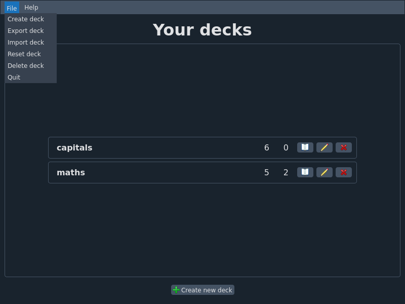
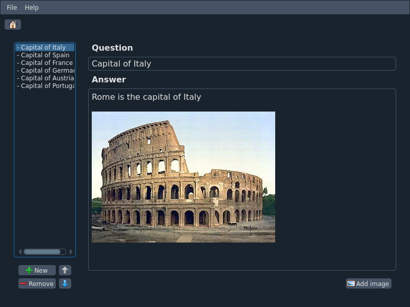
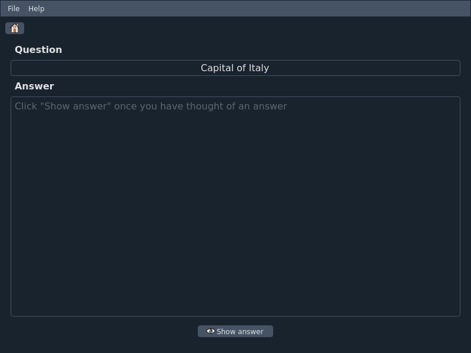

# Study and Repeat

Study and Repeat is an application that aims to integrate the spaced repetition technique into your study method.
Through it, a student or any person wishing to learn a certain topic can do it in a simple and intuitive way, optimizing time and avoiding long study sessions in the last days before the exam.
The entire development phase of the application and other information about it are available in the [paper](paper.pdf).

## Usage 
Download the file for your operating system from [latest release](https://github.com/lucabindini/study_and_repeat/releases/latest).
Alternatively, if you want to build the application on your own, follow the instructions in the [Build](#build) section.

## Build
Clone the repository in a directory of your choice:
```sh
git clone https://github.com/lucabindini/study_and_repeat 
```
Open `study_and_repeat` project folder:
```sh
cd study_and_repeat
```

Create virtual environment and install all dependencies in it (required `make` and `zip`):
```sh
make install
```

Activate the environment:
```sh
. env/bin/activate
```

Build the application (the output will be in `dist`):
```sh
make
```

## Functionalities
Below is a list of all the functionalities of the application:
* **Create deck** in your local machine with the possibility to edit it whenever you want.
* **Add card** to a desired deck. Cards can have an answer not only formed by text but enriched by images.
* **Move card** inside his deck.
* **Remove card** if it's incorrect or no longer needed.
* **Rename deck** if it has incorrect or outdated name.
* **Delete deck** if it's no longer needed.
* **Reset deck** if you want to clear spaced repetition temporal statistics.
* **Export deck** in a `.tar` archive file. During the export phase you can choose whether or not to enter the temporal information of the spaced repetition technique.
* **Import deck** from a `.tar` deck file previously exported.
* **View statistics** in particular the number of new cards (never studied) and the number of cards to be reviewed today

## GUI
The application is divided into 3 main screens.

* **Home** that is the main screen of the application.

<p align="center">

</p>

* **Edit deck** that is the screen where you can edit a certain deck.

<p align="center">

</p>

* **Study deck** that is the screen where you can study a certain deck.

<p align="center">

</p>

<p align="center">

</p>

## Authors
* [Luca Bindini](https://github.com/lucabindini)
* [Marco Benelli](https://github.com/MarcoBenelli)

## License
Licensed under the term of [GNU GPL v3.0](LICENSE).
